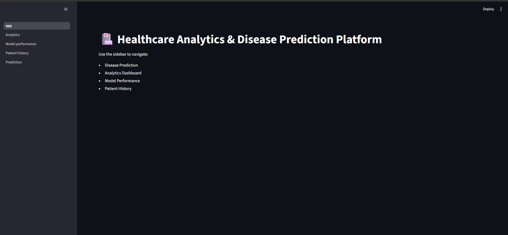
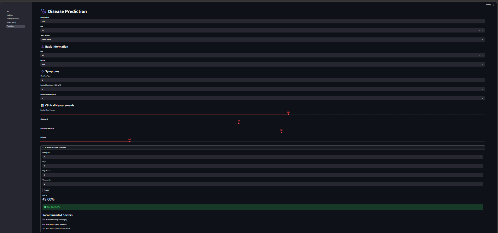
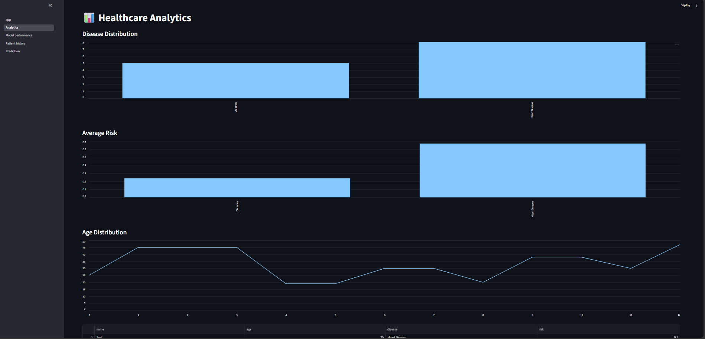
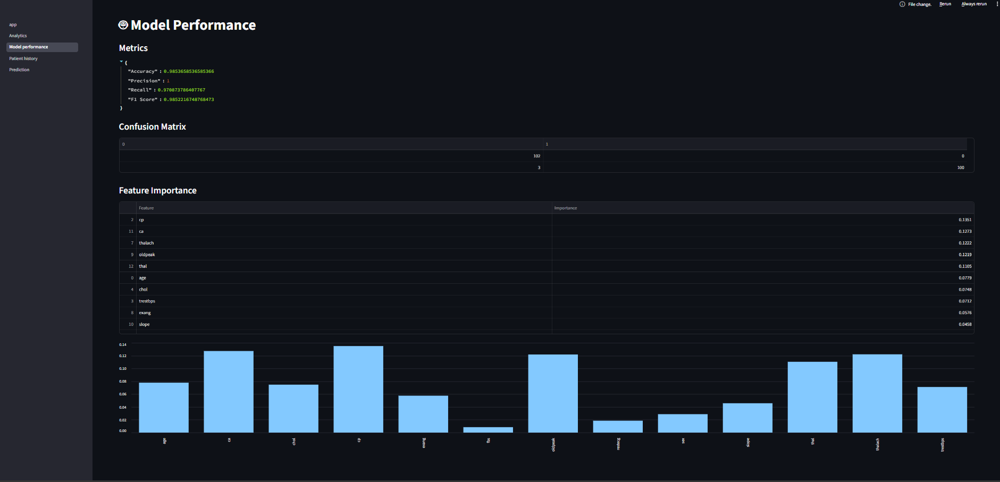
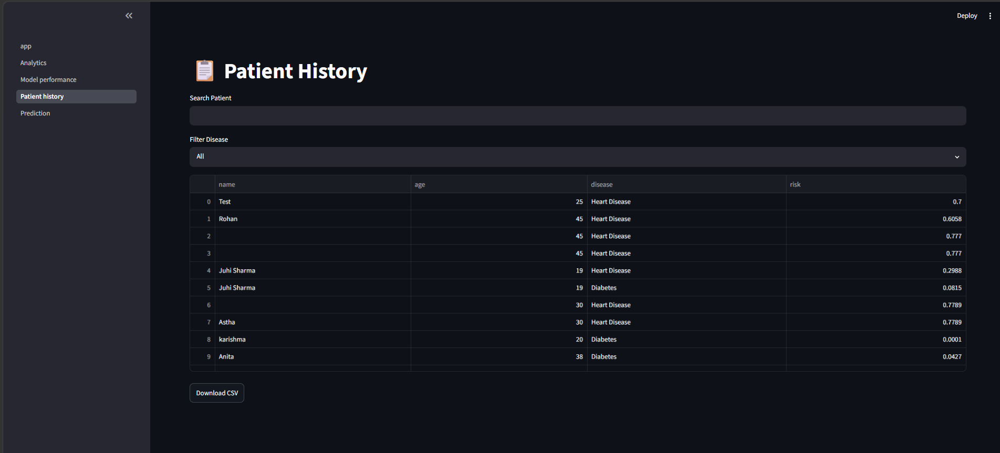

# 🏥 Healthcare Analytics & Multi-Disease Prediction Platform
Healthcare Analytics and Multi-Disease Prediction Platform using Machine Learning

## Overview

Healthcare Analytics & Multi-Disease Prediction Platform is a Machine Learning powered web application that predicts the risk of Heart Disease and Diabetes using patient health parameters.

The platform provides:

* Heart Disease Prediction
* Diabetes Prediction
* Doctor Recommendation System
* Healthcare Analytics Dashboard
* Model Performance Visualization
* Patient History Management
* MySQL Database Integration

---

## Features

### Disease Prediction

* Heart Disease Risk Prediction
* Diabetes Risk Prediction
* Probability-based Risk Assessment

### Healthcare Analytics

* Disease Distribution Analysis
* Risk Trend Visualization
* Patient Demographics Insights

### Doctor Recommendation System

* Specialist Recommendations for High-Risk Patients
* Health Guidance and Next Steps

### Patient Management

* Store Prediction Records
* Search Patient History
* Export Records

### Machine Learning

* Logistic Regression
* Random Forest Classifier
* Feature Scaling using StandardScaler
* Model Evaluation Metrics

---

## Tech Stack

* Python
* Streamlit
* Scikit-Learn
* Pandas
* NumPy
* MySQL
* Plotly
* ReportLab

---

## Project Structure

```text
Disease Prediction System/
│
├── Datasets/
├── Models/
├── Pages/
├── Reports/
├── Utils/
├── app.py
├── README.md
├── requirements.txt
└── health_db.sql
```

---


## Installation

```bash
pip install -r requirements.txt
```

```bash
streamlit run app.py
```

---
## 📸 Application Screenshots

### 🏠 Home Page



### 🩺 Disease Prediction



### 📊 Healthcare Analytics Dashboard



### 🤖 Model Performance



### 📋 Patient History



---

## Future Improvements

* SHAP Explainability
* Additional Disease Prediction Models
* Cloud Deployment
* Appointment Booking System
* Email Report Generation

---

## Author

Karishma Prajapati

B.Tech Computer Science Engineering

Machine Learning & Data Science Enthusiast
